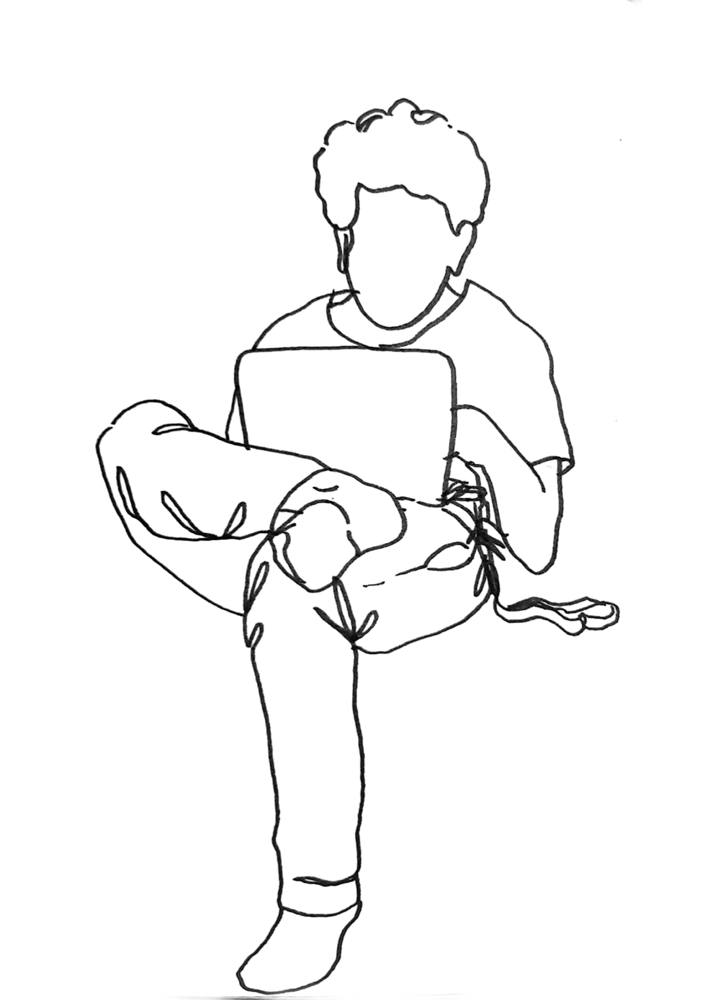

# Antonio Faonio

I am a Maître de Conférences at <A HREF="www.eurecom.fr">EURECOM</A> since July 2020.
As far as I understood, MdC in France is kinda an assistant professor with tenure or an associate professor, depending who I need to talk to.
I was a postdoctoral researcher at IMDEA Software Institute, where I was super lucky to work with Dario Fiore.
I was a postdoctoral researcher at at Aarhus University, where I was super lucky to work with Jesper Buus Nielsen.
I got a Ph.D. in Computer Science at "Sapienza" Univ. of Rome. where I was super lucky to have as advisor Giuseppe Ateniese.

I am a cryptographer, I work mostly on public-key stuff with some incursion to information-theoretic stuff (but I wish I knew more about that).
My line of work revolves around questions on non-malleability, leakage resilience, zero-knowledge, re-randomizability, etc.
I don't have a cloud picture with keywords ([like this](cloud.png)) cause I think it is lame and cause Gen-Z students won't understand it.

## About Me and Contacts

- **Location:** Antibes, Côte D'Azur (yeah, if you came visit me you'd get also free fancy French Riviera Holiday included)
- **Email:** antonio.faonio[You don't need ChatGPT to know what to put here]eurecom.fr
- [**ORCID**]()
- [**DBLP**]()
- [**Twitter**]()

## Research Group
- [Luigi Russo]()

We have open positions for PhD students! [See here]().

I am always looking for talented, highly motivated students and postdocs interested in Cryptography. Just drop me a message!

## Projects

- [PROPOLIS]()
	- With [Melek Onen]()
- [PEPR TrustInCloud](link-to-project-2)
- [PATTERN](link-to-project-3)
 - With [Melek Onen]()

## Hobbies

I am an okay runner and I always bring my running shoes and gear with me when on a conference. Here me on [Strava](). 

